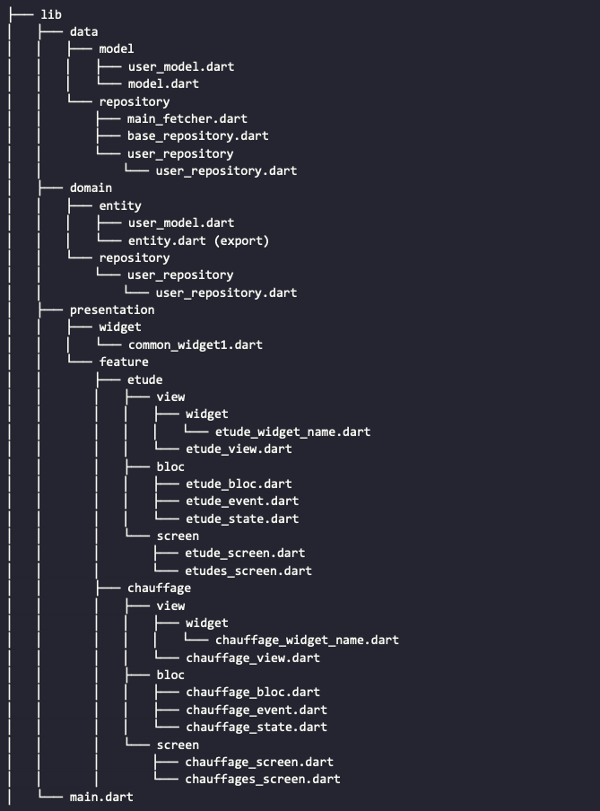

# Architecture Logicielle

L'application que j'avais produite avait un peu plus de 2 ans, et outre les changements de Flutter, elle était difficilement lisible, principalement à cause du fait que je l'ai développée de zéro, sans architecture, contrairement à la version actuelle. **Baptiste LECAT** a écrit une documentation détaillant l'architecture utilisée lors de la création d'une application Flutter.

### Architecture Logicielle




## Couche DATA

Cette couche permet de récupérer les données nécessaires au fonctionnement de l'application. Ainsi, on y retrouve notamment les éléments permettant l'interrogation d'API mais également de potentiels autres systèmes d'accès à des données (SQLite par exemple). Cette couche est donc responsable de la sérialisation et désérialisation des données, permettant ainsi de les formater en Objets. Il est ainsi possible de séparer la partie métier (DOMAIN) de la partie données pure (DATA).

Le Model présent dans DATA est la représentation stricte des données renvoyées par la source interrogée. Ainsi, les Repository sont chargés de cette interrogation et renverront le Model correspondant.

Cette couche est donc indépendante et n'a pas connaissance du traitement réalisé dans la partie DOMAINE et PRESENTATION.

### Les Repository

Un repository doit être lié à un modèle et permet d'effectuer les opérations CRUD (Create, Read, Update, Delete) de ce dernier. Il permet de contacter une et une seul source de données.

La convention de nommage est la suivante : \<Modèle>\__repository (ex: client\_repository)._&#x20;

Les fonctions à implémenter seront donc les suivantes:

* fetchAll()
* fetchOne()
* insert()
* update()
* patch() _non implémenté pour le moment_
* remove()&#x20;

Afin d'assurer la conformité de ces fonctions et leur signature, il est préférable d'étendre les classes Repository d'une classe abstraite décrivant l'implémentation de ces dernières (base\_repository.dart)

```
abstract class BaseRepository { 
    //Get ressource by ID. 
    Future<dynamic> fetchOne(
        {required int id, Map<String, String>? headers, bool? toJsonLd}); 
    
    //Get list of all objects of this ressource.
    Future<dynamic> fetchAll(
        {String? params, Map<String, String>? headers, bool? toJsonLd}); 
    
    //Post a new ressource.
    Future<dynamic> insert(
        {Map<String, String>? headers, required Object body, 
        bool? toJsonLd, bool? authDevice});
    
    ///PUT new values for a specified ressource.
    Future<dynamic> update(
        {Map<String, String>? headers, required Object body, bool?toJsonLd});
    
    //DELETE a ressource. 
    Future<dynamic> remove(
        {required int id, Map<String, String>? headers, bool? toJsonLd});
}
```

### Les Models

Ces classes sont le résultat de la désérialisation des données récupérées depuis l'API. Il est donc nécessaire que cet objet représente strictement la source de données. Elles permettent d'ajouter une couche d'abstraction entre les données de l'API et l'application.

Les sous-collections d'un Model ne sont pas désérialisées et devront être récupérées autrement.

#### Classe immutable :&#x20;

Il est nécessaire que les classes Model possèdent des attributs _**final**_. En effet, ces dernières ne sont que la représentation direct de la données brute et ne doivent donc pas pouvoir être modifiées, héritées et étendues.&#x20;

#### Sérialisation / Désérialisation

Le processus de gestion du format JSON n'est plus géré par le développeur. Grâce aux annotations JsonSerializable et au package build\_runner, les fonctions fromJson et toJson sont générées via les attributs de la classe créée par le développeur. [_(cf Annexe 5)_](../annexes.md#annexe-5-serialization-deserialisation)__

### Couche DOMAIN

Afin d'obtenir des données pertinentes pour l'UI (User Interface), il est parfois nécessaire de s'émanciper des données brutes renvoyées par l'API. Certains attributs, propriétés ou méthodes peuvent n'être pertinents que dans le contexte de l'application et n'ont donc pas leur place au sein de l'API. Ainsi la couche DOMAIN fournit des entités reflétant les données de la base de données, auxquelles sont ajoutées les méthodes et attributs nécessaires au contexte métiers.

#### Les entity

Les entités sont chargées d'implémenter les méthodes de logique métier permettant ainsi d'alléger les algorithmes au sein des Vues. Ce sont donc ces objets qui seront consommés par les Vues de la couche PRESENTATION.

### Couche PRESENTATION

#### Feature

Une Feature correspond à n'importe quelle partie de l'application que le développeur juge suffisamment importante en terme :&#x20;

* d'intérêt : Certaines feature peuvent être considérées comme importantes dans le cadre de l'application, car elles représentent des besoins exprimés par le métier.
* de quantité de code : Il est parfois intéressant durant la période de re-factorisation de séparer certaines parties jugé trop verbeuse ou réutilisable, afin de rendre le code plus lisible.
* de complexité / d'algorithmie : Lorsque la logique liée à un composant, ou une page devient trop complexe, il est parfois préférable d'isoler le code dans une Feature.

#### Bloc

La partie Bloc concerne tout le code permettant de gérer la logique métier. Elle est divisé en 3 partie :&#x20;

* event : défini les évènements qu'il est possible d'ajouter à un bloc. &#x20;
* bloc : appelle les repository de la couche DOMAIN et émet des State qui serviront à stocker les résultats du travail demandé.
* state : défini ce que peut contenir un State émit par un bloc (le state sera défini un peu plus loin)

### Sources

__[_(cf Annexe 5)_](../annexes.md#annexe-5)__
