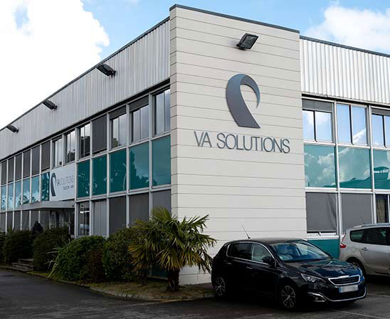

# VA Telecom

## Une entreprise de télécommunications

Depuis 2008, VA Solutions devient progressivement une société qui étend son domaine d'activité à tout les axes de communications : wifi sécurisé, liaison fibre et téléphonie IP et mobile sur tout le territoire national.

## L'équipe de développement

Afin de créer et maintenir leur infrastructure et leurs outils informatiques, VA Telecom se compose d'une équipe de développement. C'est cette équipe qui m'a de nouveau fait confiance durant ce stage :&#x20;

S'ajoute également Max OGER, qui fut mon référent pour le développement de la partie Flutter ainsi que de Baptiste LECAT, actuellement en alternance dans la société, et qui m'a également aidé sur cette partie de mon stage (là où Christophe LE MARC intervenait plutôt sur la partie PHP/Symfony).
